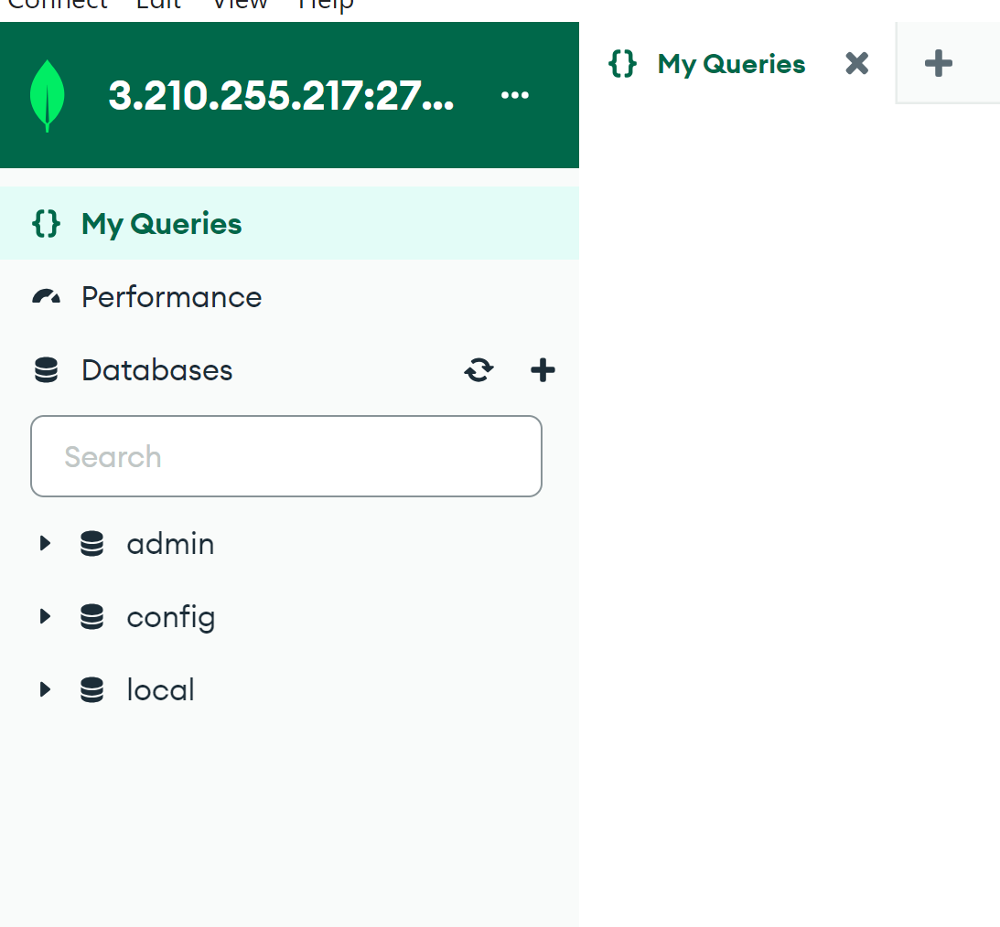
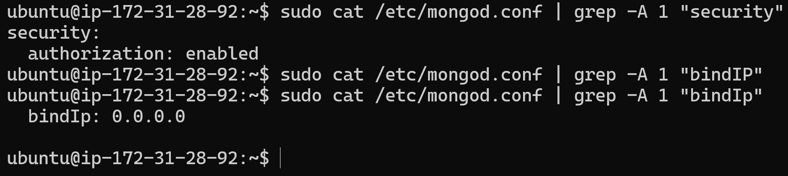
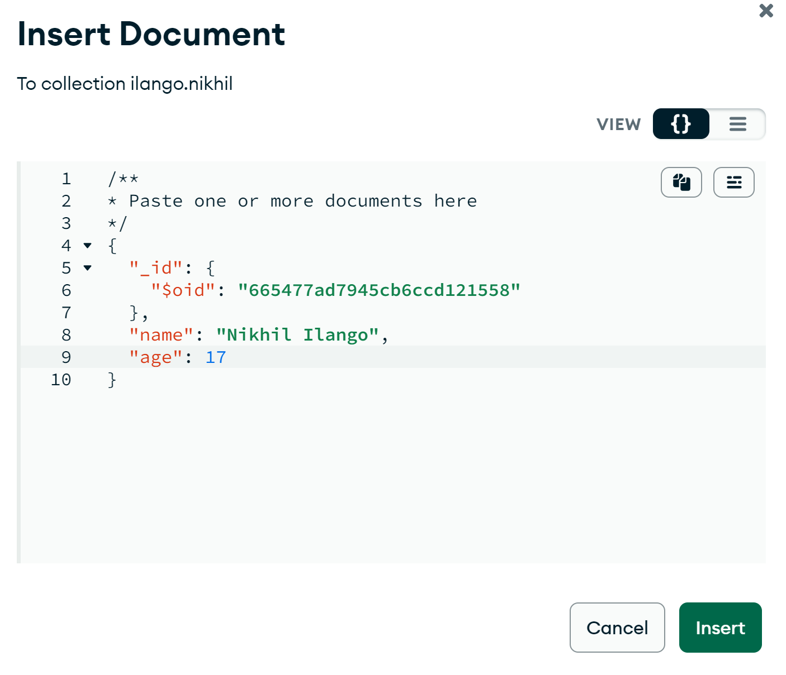
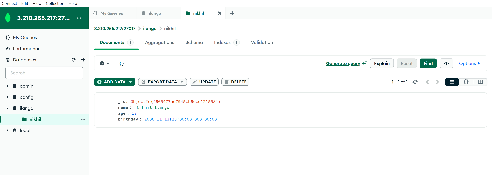
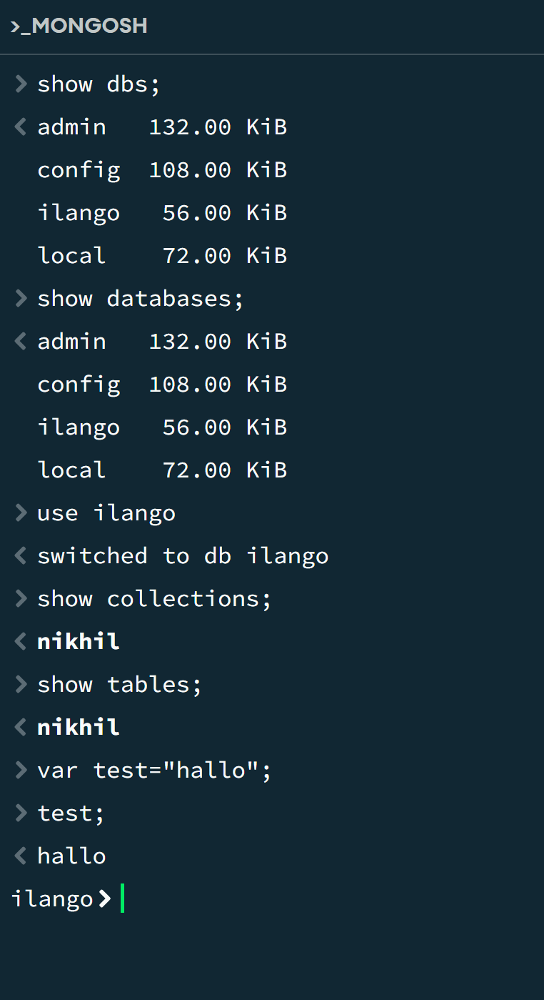
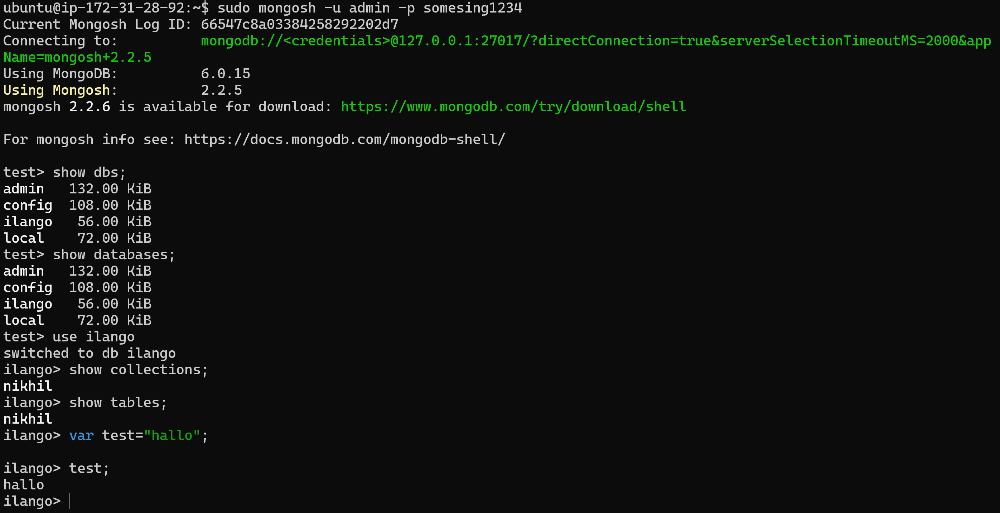

# KN01

## A

Connection String:
Das authSource wird für die Authentifizierung in der Datenbank gebraucht und hier wird admin als Benutzer gebraucht.

Sed Befehle
1. Aktiviert die Authentifizierung in MongoDB indem es /etc/mongod.conf bearbeitet
2. Ändert die IP 127.0.0.1 mit 0.0.0.0 um von localhost auf alle IP-Adressen auf dem Server.

## B

1. _id: ObjectId
2. name: String
3. age: Int32
4. birthday: Date

## C

1. show dbs; : Listet alle Datenbanken auf dem Server
2. show databases; : Das glieche wie show dbs;
3. use ilango; : Switcht zur Datenbank "ilango"
4. show collections; : Listet alle collections von der Datenbank an
5. show tables; : Gleich wie show collections;
