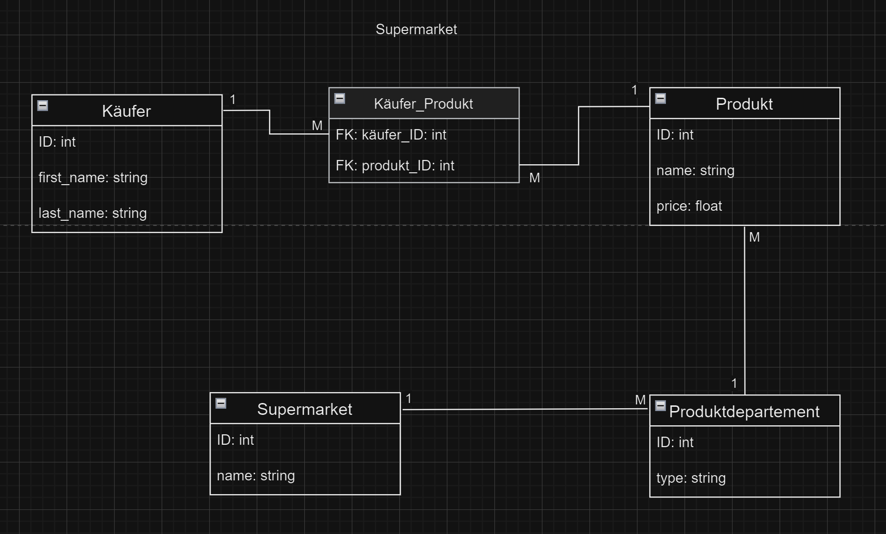
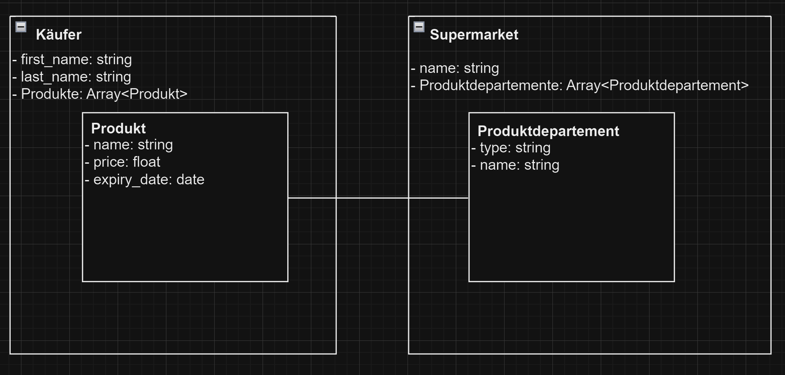

# KN02

## A

Erklärungen zu den Entitäten und Beziehungen:
    Entitäten: Käufer, Produkt, Produktdepartement, Supermarket
    Beziehungen:
        Zwischen Käufer und Produkt haben wir eine many-to-many Beziehung, da mehrere Käufer mehere Produkte kaufen können.
        Zwischen Produkt und Produktdepartement haben wir eine many-to-one Beziehung, da mehrere Produkte in einem Departement sein können.
        Zwischen Produktdepartement und Supermarket haben wir wieder eine many-to-one Beziehung, da es mehrere Deparements in einem Supermerket gib.

## B

Erklärung zu den Verschachtelungen:
    Ich habe diese Verschachtelungen gewählt, da man als Käufer mehrere Produkte einkaufen kann und diese Produkte von mehreren Departement herkommen können welche in einem einzigen Supermarket befinden.

## C

Gebrauchten Befehle:
- use supermarket
- db.createCollection("kaeufer")
- db.createCollection("supermarket")
