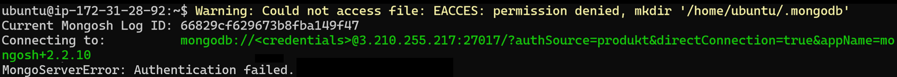
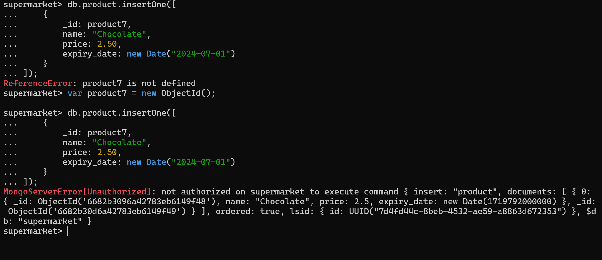
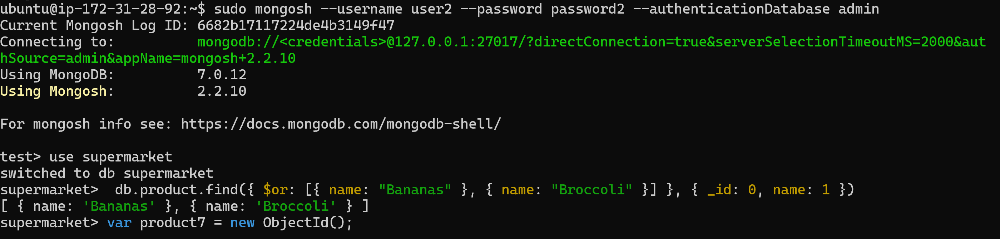

# KN05

## A

### User1

### User2

## B

### Variante 1

### Variante 2

## C
### Replikation
Replikation ist der Prozess, bei dem Daten auf mehrere Server (Replikasätze) kopiert werden, um Redundanz und hohe Verfügbarkeit zu gewährleisten. Ein Replikasatz besteht aus mehreren MongoDB-Instanzen, in denen eine als primär und die anderen als sekundär fungieren. Auf diesem Bild ist das Kopierung zu sehen.

### Partition (Sharding)
Sharding ist der Prozess, bei dem große Datenbanken horizontal in kleinere, schnellere und einfacher zu verwaltende Shards aufgeteilt werden. Jeder Shard enthält eine Teilmenge der gesamten Daten.

### Empfelung für Migros
#### Situation
Migros, nutzt eine Applikation, die auf MongoDB basiert, um Kundendaten, Bestandsverwaltung, Verkaufsdaten und andere kritische Geschäftsprozesse zu verwalten. Mit dem stetigen Wachstum der Datenmengen und der steigenden Nachfrage nach Echtzeit-Datenverarbeitung und hoher Verfügbarkeit besteht die Notwendigkeit, die Datenbankinfrastruktur zu überdenken.
#### Empfehlung
Ich würde die Replikation implementieren, da man eine höhere Verfügbarkeit hat und auch bei einem Serverausfall betriebsbereit bleibt und mehrere Kopien der Daten auf verschiedenen Servern schützen vor Datenverlust. Bei einem Ausfall eines Servers gehen keine Daten verloren, da sie auf dem zweiten Server weiterhin verfügbar sind.