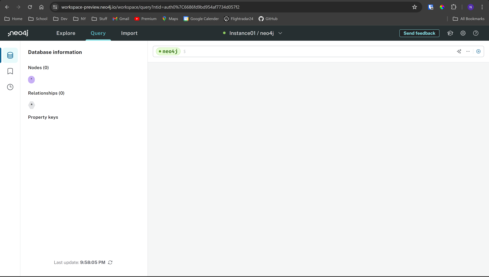
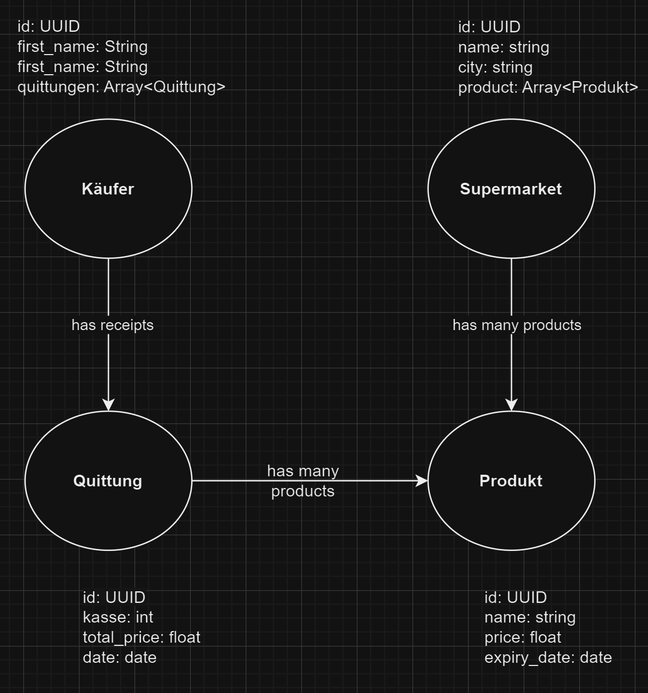

# KN07

## A

## B

Es ist grundsätzlich das genau gleiche wie beim konzeptionellen Modell im KN02. Ein Käufer hat mehrere Quittungen mit mehreren Produkten und die Produkte können in einem Supermarket sein.